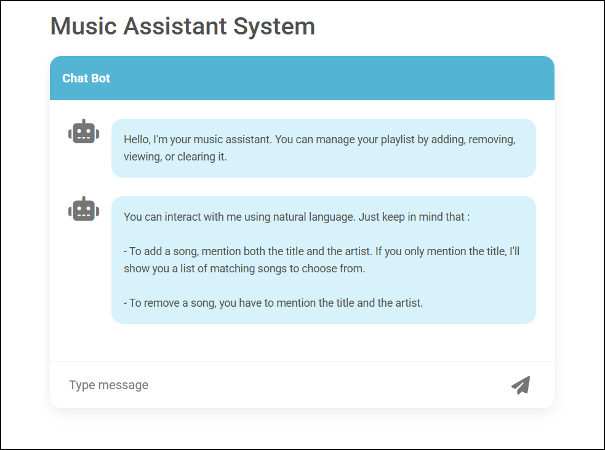
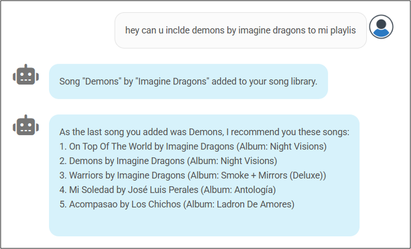
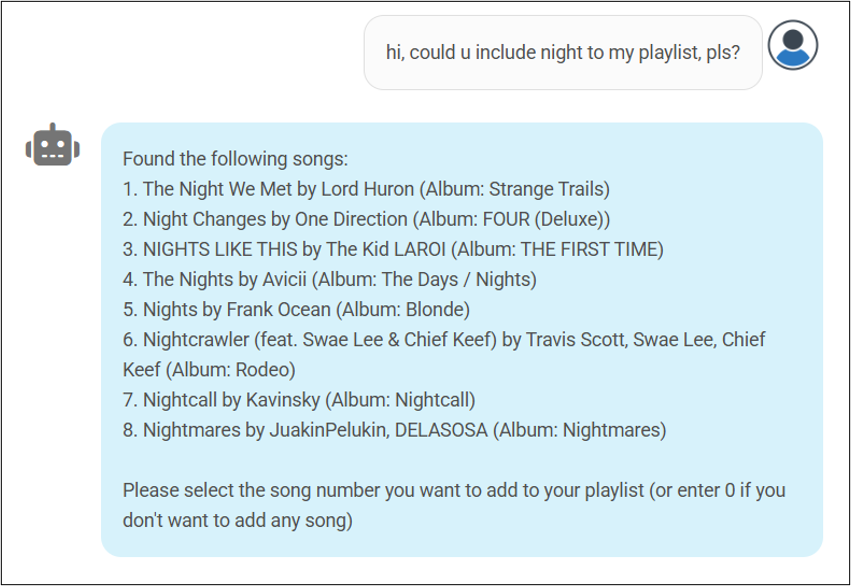
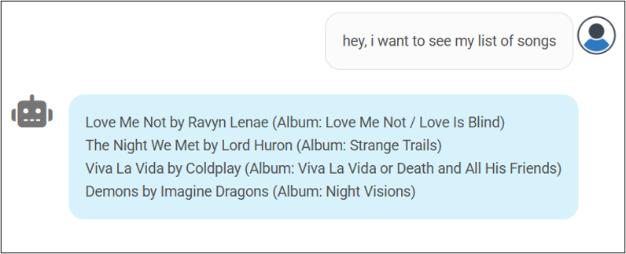
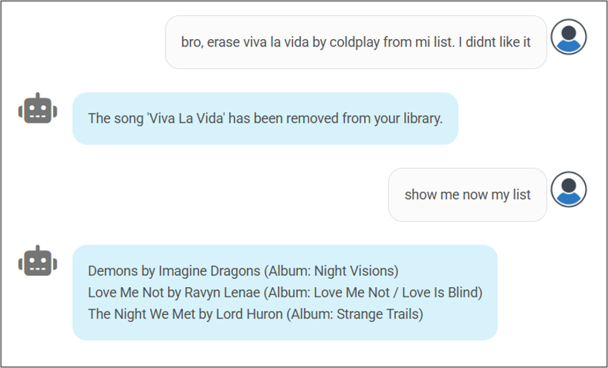
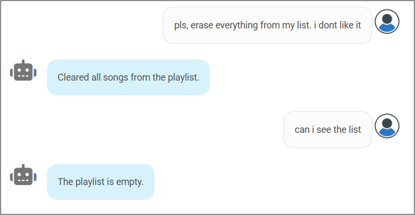

# 🎧 Music Assistant Chatbot – TFG

Este repositorio contiene el Trabajo Fin de Grado titulado

(ES) ***“Desarrollo de un Sistema Asistente de Música basado en Aprendizaje Automático y Procesamiento del Lenguaje Natural con Modelos de Lenguaje de Gran Escala”.***

(EN) ***“Development of a Music Assistant System based on Machine Learning and Natural Language Processing with Large-Scale Language Models”.***

## 🧠 Descripción del proyecto

El objetivo del proyecto es desarrollar un **asistente conversacional musical** capaz de entender comandos en lenguaje natural, como *añadir*, *eliminar*, *consultar* o *vaciar* una lista de canciones. Para ello, se han utilizado modelos avanzados basados en la arquitectura **Transformer**.

Se entrenaron y evaluaron los siguientes modelos:
- `BERT-base`
- `RoBERTa-base`
- `T5-small`

### 🧪 Metodología

    1. Creación de dataset propio con frases generadas por ChatGPT.

    2. Preprocesamiento y tokenización con Hugging Face.

    3. Entrenamiento

    4. Optimización de hiperparámetros con Optuna.

    5. Evaluación con métricas: accuracy, precision, recall, F1-score

### 📊 Resultados

| Modelo       | Accuracy | Precision | Recall | F1-score |
|--------------|----------|-----------|--------|----------|
| BERT-base    | 0.9905   | 0.9905    | 0.9905 | 0.9905   |
| RoBERTa-base | 0.9762   | 0.9762    | 0.9762 | 0.9762   |
| T5-small     | 0.9595   | 0.9622    | 0.9595 | 0.9600   |

## 📄 Documentación

A continuación se describen las carpetas y archivos clave incluidos en este proyecto:

### 📁 [`docs/`](./docs/)
Contiene los documentos finales del Trabajo de Fin de Grado:
- [`Memoria_TFG_Daniel_Linfon_Ye_Liu.pdf`](./docs/Memoria_TFG_Daniel_Linfon_Ye_Liu.pdf): Memoria del proyecto, con la descripción completa del trabajo realizado, metodología y resultados.
- [`Presentacion_TFG_Daniel_Linfon.pptx`](./docs/Presentacion_TFG_Daniel_Linfon.pptx): Diapositivas utilizadas para la defensa oral.

### 📁 [`train_models/`](./train_models/)
Incluye todos los cuadernos Jupyter utilizados para el desarrollo experimental del sistema:
- Entrenamiento de modelos como `BERT`, `RoBERTa` y `T5`.
- Visualización de curvas de pérdida.
- Evaluación de métricas (accuracy, precision, recall, F1-score).
- Optimización de hiperparámetros con Optuna.
> Estos notebooks fueron la base para analizar el rendimiento de los modelos y tomar decisiones durante el desarrollo.

### 📁 [`music_chatbot/`](./music_chatbot/)
Contiene la implementación funcional del chatbot conversacional

> Este es el núcleo del sistema: ejecutando el archivo principal aquí se lanza el chatbot musical y toda la lógica de respuesta.
## 🛠️ Tecnologías utilizadas

- Python 
- Hugging Face Transformers 
- PyTorch
- Optuna (optimización de hiperparámetros)
- Node.js (servidor)
- Socket.IO (comunicación en tiempo real)
- React (HTML/CSS/JS) (cliente)
## 💬 Ejemplos de uso

### 🔹 Inicio del chatbot

### 🔹 Comando "add" con título y artista

### 🔹 Comando "add" indicando únicamente el título

### 🔹 Consultar lista de reproducción

### 🔹 Eliminar una canción

### 🔹 Vaciar la lista

